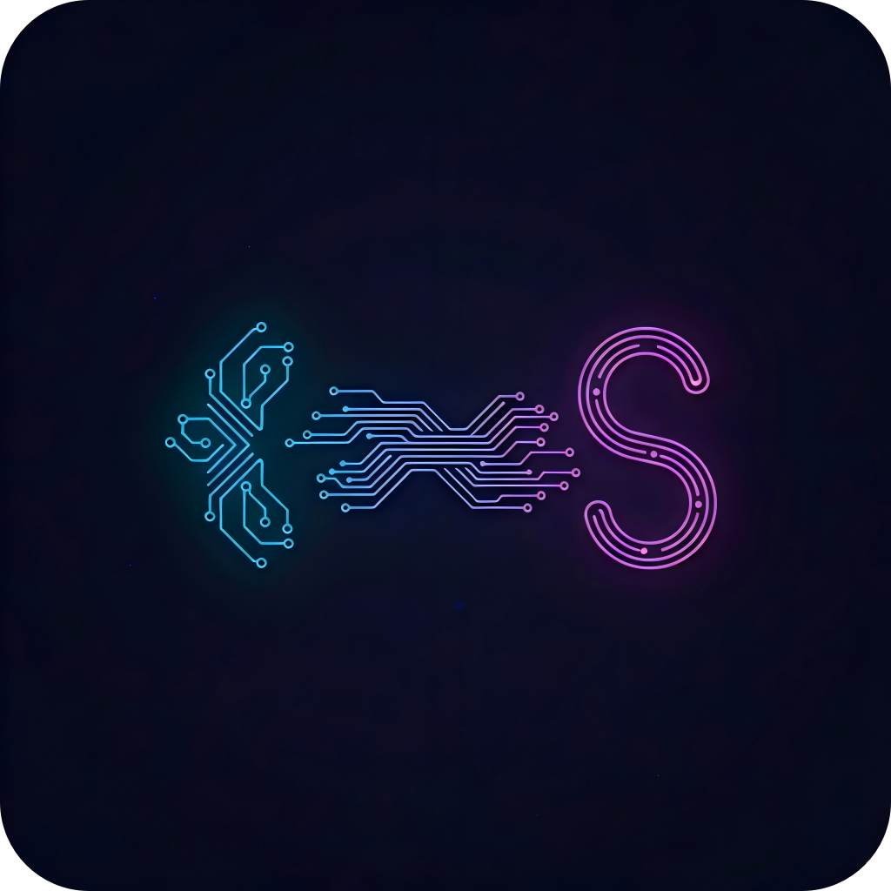
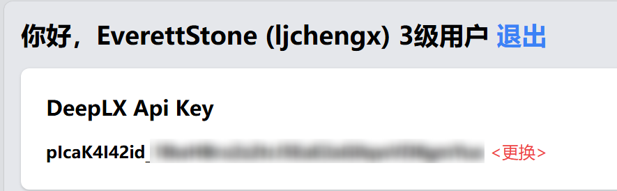
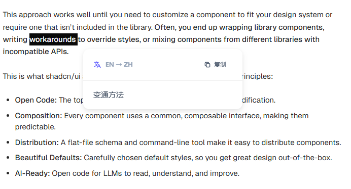
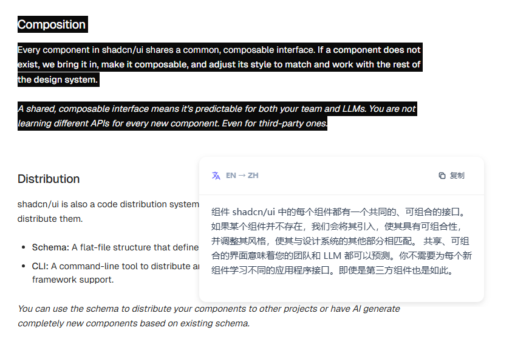
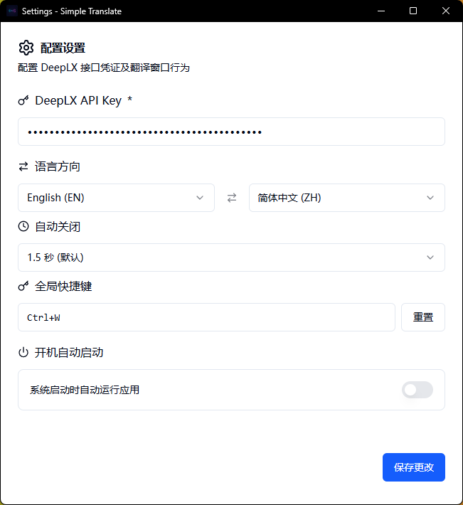
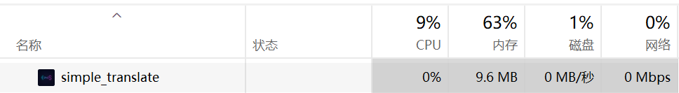

# Simple Translate

<div align="center">



**一款轻量级的 Windows 桌面翻译工具**

[](https://github.com/ljchengx/simple_translate/releases)
[](LICENSE)

[下载安装](#-下载安装) • [功能特性](#-功能特性) • [使用说明](#-使用说明) • [截图展示](#-截图展示) • [开发](#-开发)

</div>

## ⚠️ 项目状态

> **注意：** 本项目为个人自用工具，目前仅在 Windows 系统下测试，可能存在未知 BUG 和问题。欢迎反馈问题，但不保证及时修复。

**测试状态：**
- ✅ Windows 10/11 - 已测试
- ❓ macOS - 未测试
- ❓ Linux - 未测试

## ✨ 功能特性

### 核心功能
- 🎯 **全局快捷键翻译** - 默认 Ctrl+Q，可自定义，支持快捷键冲突检测
- 🪟 **智能浮窗显示** - 鼠标附近自动定位，边界检测，自适应高度
- 🌍 **多语言支持** - 支持 14 种语言互译（英、中、日、韩、法、德、西等）
- 📋 **一键复制** - 快速复制翻译结果，带视觉反馈

### 系统集成
- 🚀 **开机自动启动** - 可选择是否随系统启动，方便日常使用
- 🔔 **系统托盘集成** - 常驻托盘，鼠标悬停显示应用名称
- 🔒 **单实例运行** - 防止多开，资源占用低

### 用户体验
- ⚙️ **完整设置系统** - API Key、语言对、快捷键、自动关闭延迟、自动启动
- 🎨 **现代化界面** - 透明背景、阴影效果、深色模式适配
- ⚡ **快捷键智能检测** - 首次运行自动检测快捷键冲突，引导用户配置
- 🪶 **轻量高效** - 基于 Tauri 2.0，体积小巧，内存占用低

## 📥 下载安装

前往 [Releases](https://github.com/ljchengx/simple_translate/releases) 页面下载最新版本的安装包。

**系统要求：** Windows 10/11

## 🚀 使用说明

### 获取 API Key

本项目使用 [Linux.do 社区](https://linux.do/) 提供的 DeepLX API 服务。

<div align="center">

</div>

**获取步骤：**
1. 访问 [Linux.do](https://linux.do/)
2. 注册并登录账号
3. 在个人设置中获取 DeepLX API Key

### 首次使用

1. **安装并启动应用**，会自动打开设置窗口
2. **输入 API Key** - 从 [Linux.do](https://linux.do/) 获取的 DeepLX API Key
3. **选择语言对** - 源语言和目标语言（如：英语 → 中文）
4. **自定义快捷键**（可选）- 默认 Ctrl+Q，支持冲突检测
5. **配置自动启动**（可选）- 选择是否开机自动启动
6. **调整自动关闭延迟**（可选）- 翻译窗口自动关闭时间（1-3秒）
7. 点击 **"保存设置"**

> 💡 **提示：** 如果默认快捷键 Ctrl+Q 被其他软件占用，应用会自动提示你选择其他快捷键。

### 日常使用

1. **选中任意文本** - 在任何应用中选中需要翻译的文本
2. **按下快捷键** - 默认 Ctrl+Q
3. **查看翻译结果** - 翻译结果会在鼠标附近弹出
4. **复制或关闭** - 点击复制按钮或按 ESC 关闭，鼠标移开 1.5 秒后自动关闭

### 系统托盘

应用会在系统托盘运行，鼠标悬停显示 "Simple Translate"。

**右键托盘图标可以：**
- 📝 打开设置
- ❌ 退出应用

## 📸 截图展示

### 使用演示
<div align="center">

</div>

### 翻译单词
<div align="center">

</div>

### 翻译长句
<div align="center">

</div>

### 设置界面
<div align="center">

</div>

### 超低资源占用
<div align="center">

</div>

## 🛠️ 技术栈

- **前端框架：** React 19 + TypeScript
- **桌面框架：** Tauri 2.0
- **后端语言：** Rust
- **UI 组件：** Radix UI + Tailwind CSS 4
- **构建工具：** Vite
- **翻译服务：** DeepLX API (via Linux.do)

## 💻 开发

### 环境要求

- Node.js 18+
- Rust 1.70+
- pnpm/npm

### 安装依赖

```bash
npm install
```

### 开发模式

```bash
npm run tauri dev
```

### 构建应用

```bash
npm run tauri build
```

构建产物位于 `src-tauri/target/release/bundle/`

## 📝 支持的语言

- 🇬🇧 英语 (EN)
- 🇨🇳 简体中文 (ZH)
- 🇯🇵 日语 (JA)
- 🇰🇷 韩语 (KO)
- 🇫🇷 法语 (FR)
- 🇩🇪 德语 (DE)
- 🇪🇸 西班牙语 (ES)
- 🇷🇺 俄语 (RU)
- 🇮🇹 意大利语 (IT)
- 🇵🇹 葡萄牙语 (PT)
- 🇸🇦 阿拉伯语 (AR)
- 🇳🇱 荷兰语 (NL)
- 🇵🇱 波兰语 (PL)
- 🇹🇷 土耳其语 (TR)

## 🔧 常见问题

### API Key 验证失败（401 Unauthorized）？

如果遇到 "API Key 验证失败: API returned status code: 401 Unauthorized" 错误：

1. 访问 [Linux.do](https://linux.do/) 个人设置页面
2. 重新生成或更新 DeepLX API Key
3. 在应用设置中更新为新的 API Key
4. 保存设置后重试

> 💡 **提示：** API Key 可能会过期或失效，定期检查并更新可以避免翻译失败。

### 快捷键不工作？

1. 检查快捷键是否被其他软件占用
2. 打开设置，尝试更换其他快捷键组合
3. 确保应用正在运行（系统托盘有图标）

### 翻译失败？

1. 检查 API Key 是否正确配置
2. 确保网络连接正常
3. 检查 [Linux.do](https://linux.do/) API 服务状态

### 如何卸载？

1. 右键托盘图标，选择"退出应用"
2. 在 Windows 设置中卸载应用
3. 配置文件会自动清理

## 📄 许可证

MIT License

## 🙏 致谢

- [Linux.do](https://linux.do/) - 提供 DeepLX API 服务
- [Tauri](https://tauri.app/) - 跨平台桌面应用框架
- [Radix UI](https://www.radix-ui.com/) - 无障碍 UI 组件

---

<div align="center">

**🤖 Generated with [Claude Code](https://claude.com/claude-code)**

</div>
