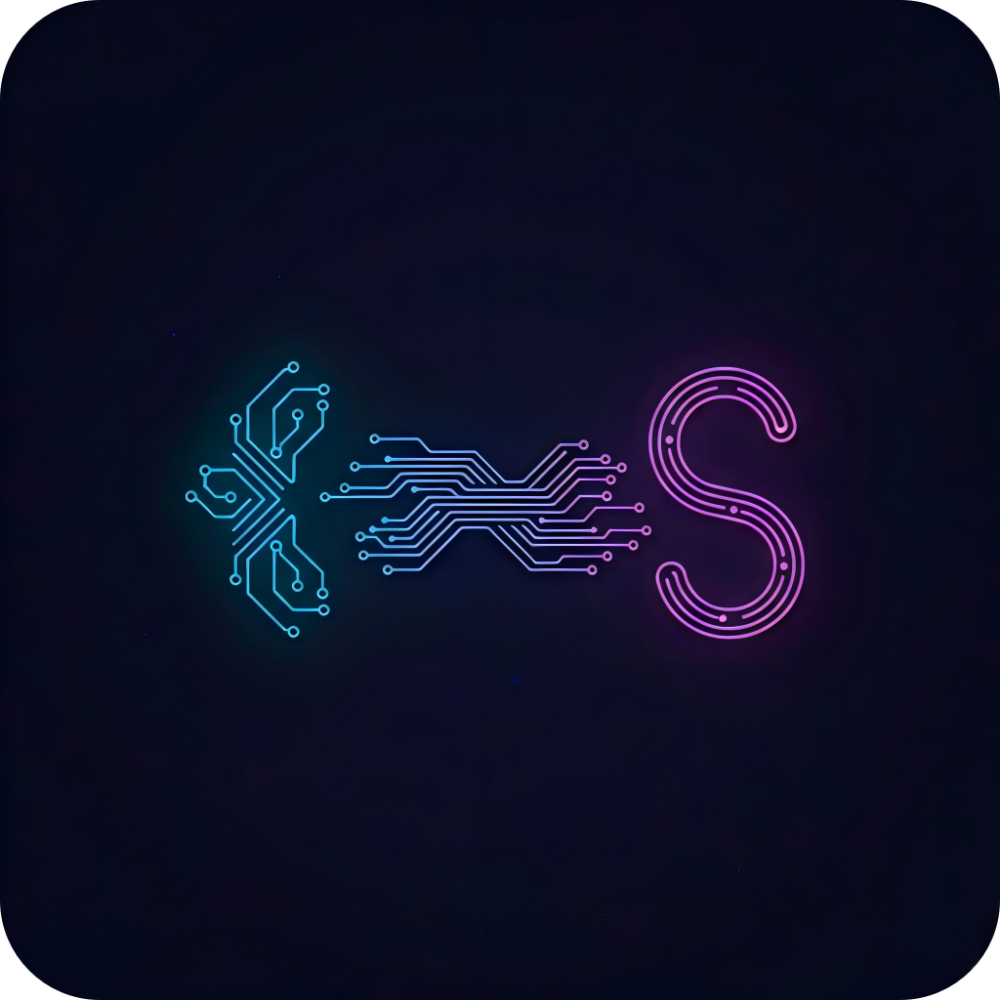
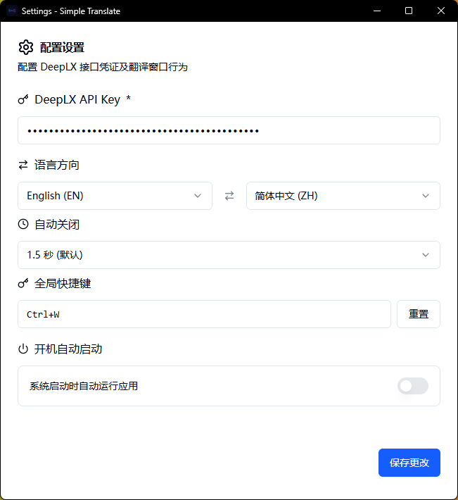

# Simple Translate

<div align="center">



一个基于 Tauri 2 + React + Rust 的轻量级桌面划词翻译工具。

[](https://github.com/ljchengx/simple_translate/releases)
[](LICENSE)

</div>

## 项目状态

- 当前版本：`v1.2.1`
- 已验证平台：`Windows 10/11`、`macOS (Apple Silicon)`
- Linux：可编译但未系统化验证

## 核心能力

- 全局快捷键翻译：默认 `Ctrl+Q`，支持自定义组合键与冲突检测。
- 鼠标附近弹窗：翻译结果在光标附近弹出，支持多显示器和高 DPI 定位。
- 自动关闭策略：
  - 开启自动关闭时可选 `1s / 1.5s / 2s / 3s`
  - 可选“不开启计时关闭（0）”，此时支持全局 `ESC` 关闭
  - 关闭自动关闭时，窗口失焦后自动隐藏
- 一键复制：弹窗内可直接复制翻译结果。
- 托盘常驻：托盘菜单支持“设置 / 退出”。
- 开机自启：可在设置中启用或关闭。
- 单实例运行：阻止多开，避免冲突。

## 最新代码更新（基于当前仓库）

### v1.2.1

- 统一自动关闭超时时间的合法值校验（`0/1000/1500/2000/3000`）。
- 依赖版本更新。

### v1.2.0

- 新增“不自动关闭（0）”选项。
- 新增全局 `ESC` 关闭逻辑（在不自动关闭模式下生效）。

### v1.1.x（近期关键改动）

- 增强多显示器定位与边界处理。
- 优化自动隐藏与窗口显示行为。
- 增强 macOS 兼容性。

## 使用前准备

本项目默认使用 DeepLX 接口：

- 翻译请求地址格式：`https://api.deeplx.org/{api_key}/translate`
- 你需要先准备可用的 `API Key`（README 历史中推荐来源为 Linux.do 社区）

## 使用说明

1. 启动应用后，首次运行会自动打开设置窗口。
2. 配置 `API Key`。
3. 选择源语言与目标语言。
4. 按需设置：全局快捷键、自动关闭策略、开机自启。
5. 在任意应用中选中文本，按快捷键触发翻译。
6. 在弹窗中查看并复制结果，或按 `ESC` 关闭。

## 截图

### 操作演示

<div align="center">

</div>

### 设置界面

<div align="center">

</div>

## 开发与构建

### 环境要求

- `Node.js 18+`
- `Rust stable`（建议最新版）
- 各平台 Tauri 运行依赖（WebView / 构建工具链）

### 安装依赖

```bash
npm install
```

### 前端开发（仅 Web）

```bash
npm run dev
```

### 桌面开发（Tauri）

```bash
npm run tauri dev
```

### 构建桌面应用

```bash
npm run tauri build
```

构建产物位于：`src-tauri/target/release/bundle/`

## 支持语言

当前内置 14 种语言代码：

- `EN` English
- `ZH` 简体中文
- `JA` 日本語
- `KO` 한국어
- `FR` Français
- `DE` Deutsch
- `ES` Español
- `RU` Русский
- `IT` Italiano
- `PT` Português
- `AR` العربية
- `NL` Nederlands
- `PL` Polski
- `TR` Türkçe

## 常见问题

### 1) API Key 校验失败（如 401 Unauthorized）

- 确认 `API Key` 是否仍然有效。
- 确认请求地址和网络连接正常。
- 在设置中重新保存 `API Key` 后重试。

### 2) 快捷键无响应

- 检查是否与其他软件冲突。
- 在设置里更换快捷键组合并保存。
- 确认应用正在托盘中运行。

### 3) 选中文本后没有翻译

- 确认目标应用允许复制选中文本（程序内部通过模拟 `Ctrl/Cmd + C` 读取选中文本）。
- 重试后仍失败时，检查是否有剪贴板权限或系统安全限制。

## 技术栈

- Frontend：React 19 + TypeScript + Vite
- Desktop：Tauri 2
- Backend：Rust
- UI：Radix UI + Tailwind CSS 4

## License

MIT
